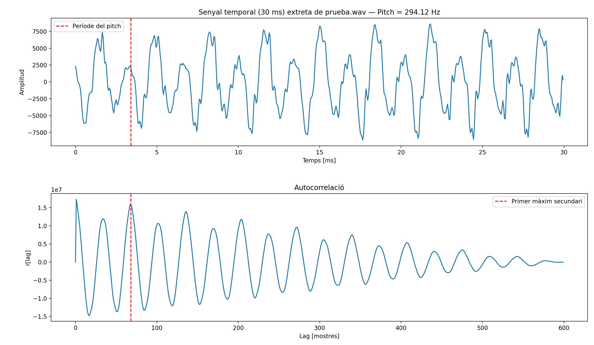
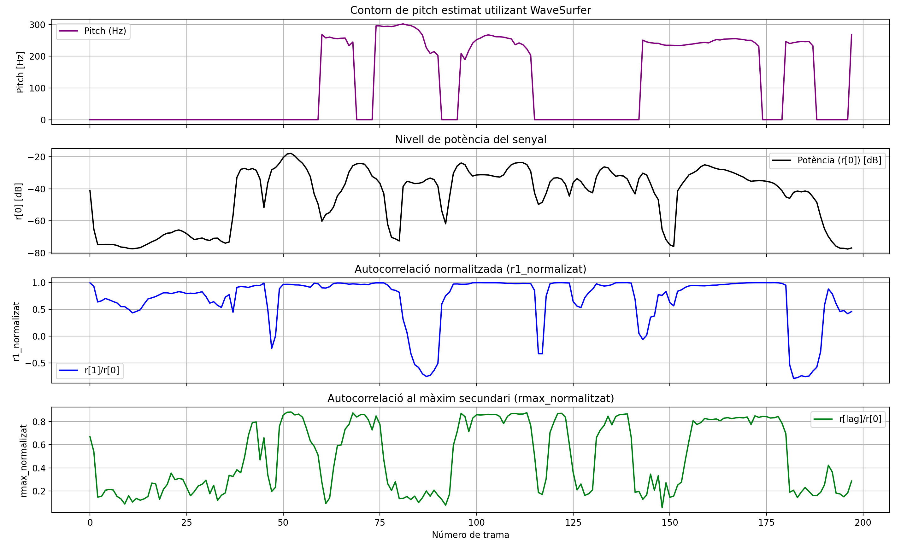
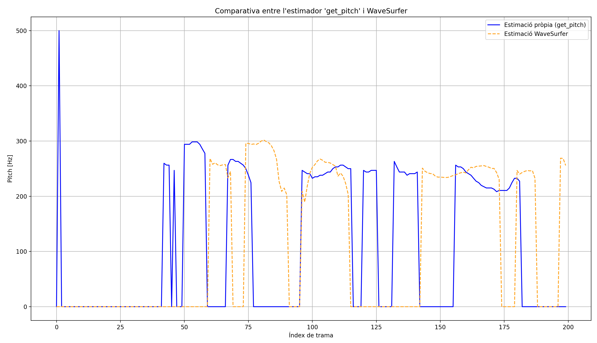
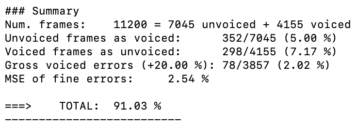
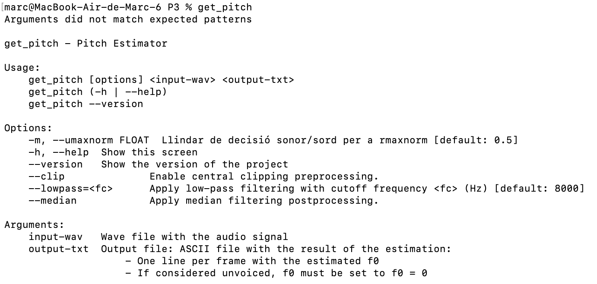
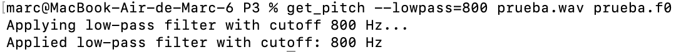

PAV - P3: estimación de pitch
=============================

Ignasi Fernández Bilbeny i Marc Elvira Pallardó
-----------------------------

Esta práctica se distribuye a través del repositorio GitHub [Práctica 3](https://github.com/albino-pav/P3).
Siga las instrucciones de la [Práctica 2](https://github.com/albino-pav/P2) para realizar un `fork` de la
misma y distribuir copias locales (*clones*) del mismo a los distintos integrantes del grupo de prácticas.

Recuerde realizar el *pull request* al repositorio original una vez completada la práctica.

Ejercicios básicos
------------------

- Complete el código de los ficheros necesarios para realizar la estimación de pitch usando el programa
  `get_pitch`.

   * Complete el cálculo de la autocorrelación e inserte a continuación el código correspondiente.
  ```cpp 
   void PitchAnalyzer::autocorrelation(const vector<float> &x, vector<float> &r) const {
    unsigned int N = x.size();   // longitud real de la trama

    for (unsigned int l = 0; l < r.size(); ++l) {
  		/// \TODO Compute the autocorrelation r[l] 
      float sum = 0.0F;
      for (unsigned int n = 0; n < N - l; ++n) {
        sum += x[n] * x[n + l];
      }

      r[l] = sum / static_cast<float>(N);
    }

    if (r[0] == 0.0F) //to avoid log() and divide zero 
      r[0] = 1e-10; 
    }
  ```
   * Inserte una gŕafica donde, en un *subplot*, se vea con claridad la señal temporal de un segmento de
     unos 30 ms de un fonema sonoro y su periodo de pitch; y, en otro *subplot*, se vea con claridad la
	 autocorrelación de la señal y la posición del primer máximo secundario.

	 NOTA: es más que probable que tenga que usar Python, Octave/MATLAB u otro programa semejante para
	 hacerlo. Se valorará la utilización de la biblioteca matplotlib de Python.

   A la carpeta "scripts" trobem el fitxer "subplot.py" que és el que ens genera aquestes gràfiques.

    

   * Determine el mejor candidato para el periodo de pitch localizando el primer máximo secundario de la
     autocorrelación. Inserte a continuación el código correspondiente.

  ```cpp
      float PitchAnalyzer::compute_pitch(vector<float> & x) const {
          if (x.size() != frameLen)
            return -1.0F;

          //Window input frame
          for (unsigned int i=0; i<x.size(); ++i)
            x[i] *= window[i];

          vector<float> r(npitch_max);

          //Compute correlation
          autocorrelation(x, r);

          vector<float>::const_iterator iR = r.begin(), iRMax = iR + npitch_min;


          iRMax = std::max_element(iR + npitch_min, iR + npitch_max);
          unsigned int lag = iRMax - r.begin();

          // Després de trobar lag
        bool peak_reliable = true;

        // Comprovem que no sigui un pic pla o lateralment més baix
        if (lag > 1 && lag + 1 < npitch_max) {
          if (!(r[lag] > r[lag-1] && r[lag] > r[lag+1])) {
            peak_reliable = false;
          }
        }

      // Si el pic no és fiable, intentem l'harmònic a la meitat del lag
        if (!peak_reliable) {
          unsigned int lag_harm = lag / 2;
          if (lag_harm >= npitch_min && lag_harm + 1 < npitch_max) {
            if (r[lag_harm] > r[lag_harm-1] && r[lag_harm] > r[lag_harm+1] &&
                r[lag_harm] > 0.4F * r[0]) {       // llindar perquè sigui prou fort
              lag = lag_harm;
              peak_reliable = true;
            }
          }
        }

        // Si segueix sense ser fiable, el marquem com a sordo
        float pot = 10 * log10(r[0]);
        float r1norm   = r[1] / r[0];
        float rmaxnorm = r[lag] / r[0];

        if (!peak_reliable || unvoiced(pot, r1norm, rmaxnorm))
          return 0.0F;
        else
          return (float) samplingFreq / (float) lag;
        }
  ``` 
   * Implemente la regla de decisión sonoro o sordo e inserte el código correspondiente.
  ```cpp
      bool PitchAnalyzer::unvoiced(float pot, float r1norm, float rmaxnorm) const {
        const float threshold_pot = -49.0f;    
        const float threshold_r1 = 0.46f;        
        const float threshold_rmax = 0.48f;     
    
        if (rmaxnorm > 0.60f && pot > -40.0f) {
          return false;  
        }
    
        if (rmaxnorm > 0.58f && r1norm > 0.52f && pot > -40.0f) {
          return false;  
        }
    
        if ((pot < threshold_pot) || (r1norm < threshold_r1) || (rmaxnorm < threshold_rmax)){
          if ((pot > -42.0f && rmaxnorm > 0.36f && r1norm > 0.42f) || (pot > -46.0f && rmaxnorm > 0.45f)) {
            return false;  
          }
          return true;  
        } else {
          return false;  
        }
      }
  ```

   * Puede serle útil seguir las instrucciones contenidas en el documento adjunto `código.pdf`.

- Una vez completados los puntos anteriores, dispondrá de una primera versión del estimador de pitch. El 
  resto del trabajo consiste, básicamente, en obtener las mejores prestaciones posibles con él.

  * Utilice el programa `wavesurfer` para analizar las condiciones apropiadas para determinar si un
    segmento es sonoro o sordo. 
	
	  - Inserte una gráfica con la estimación de pitch incorporada a `wavesurfer` y, junto a ella, los 
	    principales candidatos para determinar la sonoridad de la voz: el nivel de potencia de la señal
		(r[0]), la autocorrelación normalizada de uno (r1norm = r[1] / r[0]) y el valor de la
		autocorrelación en su máximo secundario (rmaxnorm = r[lag] / r[0]).

		Puede considerar, también, la conveniencia de usar la tasa de cruces por cero.

	    Recuerde configurar los paneles de datos para que el desplazamiento de ventana sea el adecuado, que
		en esta práctica es de 15 ms.

    A la carpeta "scripts" trobem el fitxer "cand_det_pot.py" que és el que ens genera aquestes gràfiques.

    

      - Use el estimador de pitch implementado en el programa `wavesurfer` en una señal de prueba y compare
	    su resultado con el obtenido por la mejor versión de su propio sistema.  Inserte una gráfica
		ilustrativa del resultado de ambos estimadores.
     
		Aunque puede usar el propio Wavesurfer para obtener la representación, se valorará
	 	el uso de alternativas de mayor calidad (particularmente Python).

    A la carpeta "scripts" trobem el fitxer "comp_mejor_ver.py" que és el que ens genera aquesta gràfica.

    
  
  * Optimice los parámetros de su sistema de estimación de pitch e inserte una tabla con las tasas de error
    y el *score* TOTAL proporcionados por `pitch_evaluate` en la evaluación de la base de datos 
	`pitch_db/train`..

  Per tal de millorar el rendiment de l’estimador de pitch, s’han ajustat de manera empírica els paràmetres de la decisió voiced/unvoiced. 
  Aquest procés s’ha basat en l’anàlisi dels valors de la potència (pot), de l’autocorrelació normalitzada al primer retard (r1norm) i del valor normalitzat del màxim secundari de l’autocorrelació (rmaxnorm). 
  
  Aquests valors s’han examinat prèviament mitjançant gràfiques generades amb wavesurfer, fet que ha permès identificar els rangs habituals per a segments sonors i segments sords. 
  
  El procediment d’optimització ha consistit en: 
  
  1. **Ajustar els llindars principals** (threshold_pot, threshold_r1, threshold_rmax) per reduir tant els falsos positius (unvoiced→voiced) com els falsos negatius (voiced→unvoiced). 
  2. **Afegir condicions complementàries** que reforcen la decisió de voiced quan la correlació presenta pics robustos. 
  3. **Avaluar sistemàticament l’efecte de cada modificació**, executant el script run_get_pitch.sh i posteriorment pitch_evaluate sobre la base de dades pitch_db/train. 
  
  Després de diverses iteracions, s’ha obtingut una configuració estable que proporciona un bon equilibri entre sensibilitat i fiabilitat, amb un score final del 91.03 %.

  Taula:

  | **Error Type**                   | **Number of errors** |   **%**    |
  |----------------------------------|----------------------|------------|
  | Unvoiced frames as voiced        | 352/7045             | 5.00 %     |
  | Voiced frames as unvoiced        | 298/4155             | 7.17 %     |
  | Gross voiced errors (+20 %)      | 78/3887              | 2.02 %     |
  | MSE of fine errors               | –                    | 2.54 %     |
  | **TOTAL**                        | –                    | **91.03 %**|


Captura de pantalla:



Ejercicios de ampliación
------------------------

- Usando la librería `docopt_cpp`, modifique el fichero `get_pitch.cpp` para incorporar los parámetros del
  estimador a los argumentos de la línea de comandos.
  
  Esta técnica le resultará especialmente útil para optimizar los parámetros del estimador. Recuerde que
  una parte importante de la evaluación recaerá en el resultado obtenido en la estimación de pitch en la
  base de datos.

  * Inserte un *pantallazo* en el que se vea el mensaje de ayuda del programa y un ejemplo de utilización
    con los argumentos añadidos.

    

    

- Implemente las técnicas que considere oportunas para optimizar las prestaciones del sistema de estimación
  de pitch.

  Entre las posibles mejoras, puede escoger una o más de las siguientes:

  * Técnicas de preprocesado: filtrado paso bajo, diezmado, *center clipping*, etc.
  * Técnicas de postprocesado: filtro de mediana, *dynamic time warping*, etc.
  * Métodos alternativos a la autocorrelación: procesado cepstral, *average magnitude difference function*
    (AMDF), etc.
  * Optimización **demostrable** de los parámetros que gobiernan el estimador, en concreto, de los que
    gobiernan la decisión sonoro/sordo.
  * Cualquier otra técnica que se le pueda ocurrir o encuentre en la literatura.

  Encontrará más información acerca de estas técnicas en las [Transparencias del Curso](https://atenea.upc.edu/pluginfile.php/2908770/mod_resource/content/3/2b_PS%20Techniques.pdf)
  y en [Spoken Language Processing](https://discovery.upc.edu/iii/encore/record/C__Rb1233593?lang=cat).
  También encontrará más información en los anexos del enunciado de esta práctica.

  Incluya, a continuación, una explicación de las técnicas incorporadas al estimador. Se valorará la
  inclusión de gráficas, tablas, código o cualquier otra cosa que ayude a comprender el trabajo realizado.

  También se valorará la realización de un estudio de los parámetros involucrados. Por ejemplo, si se opta
  por implementar el filtro de mediana, se valorará el análisis de los resultados obtenidos en función de
  la longitud del filtro.

  Per tal de millorar les prestacions del nostre sistema d’estimació de pitch, hem incorporat un conjunt de tècniques de preprocessat, ajustos en la decisió sonor/sord i diversos mètodes de postprocessat orientats a reduir errors d’octava, descontinuïtats i classificacions incorrectes. En primer lloc, hem aplicat un central clipping adaptatiu, treballat per trames i amb un llindar proporcional al pic local de la senyal. Aquesta estratègia reforça els harmònics principals i facilita una autocorrelació més neta i robusta. Paral·lelament, hem afegit un filtrat passa-baix, amb una freqüència de tall reduïda per eliminar components d’alta freqüència que no aporten informació rellevant al fonamental. 
  
  Pel que fa al nucli de l’estimació, hem utilitzat un analitzador de pitch amb finestra Hamming i un VAD independent amb finestra rectangular. Hem ajustat de manera empírica els llindars que governen la decisió voiced/unvoiced —potència, correlació al primer retard i correlació màxima normalitzada— així com la fiabilitat del pic principal de l’autocorrelació i la seva substitució pel seu harmònic quan això millora la consistència. Aquest procés iteratiu, validat contínuament amb pitch_db/train, ens ha permès reduir tant els falsos positius com els falsos negatius. 
  
  Finalment, hem implementat un postprocessat avançat basat en un filtre de mediana millorat, la correcció de segments molt curts etiquetats com a sordos i la recuperació selectiva de trames sonores perdudes en zones de pitch estable. Aquestes tècniques ens han permès suavitzar descontinuïtats, corregir errors puntuals i estabilitzar el contorn final. La incorporació de mètodes per reparar trames aïllades basant-nos en la coherència del pitch veí també ha contribuït a reduir errors d’octava i inconsistències locals. 
  
  Amb totes aquestes millores, el nostre sistema ha assolit un score final del **91.84%**, obtenint una disminució clara dels errors grossos i una millor separació entre segments sonors i segments sords. Els resultats finals mostren una configuració equilibrada, estable i ben ajustada al nostre conjunt de proves.

  * Center Clipping:

  ```cpp
    void centralClipping(vector<float>& x, float threshold_factor = 0.3f) {
    // Process in frames for better local adaptation
    const int frame_size = 320; // ~20ms at 16kHz
    
    for (size_t frame_start = 0; frame_start < x.size(); frame_start += frame_size) {
        size_t frame_end = min(frame_start + frame_size, x.size());
        
        // Find peak amplitude in this frame
        float peak = 0.0f;
        for (size_t i = frame_start; i < frame_end; ++i) {
            if (fabs(x[i]) > peak) peak = fabs(x[i]);
        }
        
        // Set adaptive threshold as a percentage of the frame peak
        float threshold = peak * threshold_factor;
        
        // Apply central clipping with preserved amplitudes
        for (size_t i = frame_start; i < frame_end; ++i) {
            if (fabs(x[i]) < threshold) {
                x[i] = 0.0f;
            } else if (x[i] > 0) {
                x[i] = x[i] - threshold; // Preserve amplitude information
            } else {
                x[i] = x[i] + threshold; // Preserve amplitude information
            }
        }
    }
  }
  ```

  * Filtre de mediana:

  ```cpp
    vector<float> medianFilter(const vector<float>& f0, int window_size = 5) {
    vector<float> filtered = f0; // Start with original values
    int half = window_size / 2;
    
    for (size_t i = 0; i < f0.size(); ++i) {
        // Skip processing if this is a reliable voiced frame
        if (f0[i] > 0) {
            // Don't filter reliable frames with good context
            bool has_consistent_context = true;
            int context_voiced = 0;
            
            // Check consistency with surrounding frames
            for (int j = -2; j <= 2; ++j) {
                if (j == 0) continue;
                size_t idx = i + j;
                if (idx < f0.size() && f0[idx] > 0) {
                    context_voiced++;
                    float ratio = max(f0[i], f0[idx]) / min(f0[i], f0[idx]);
                    // Detect octave jumps (ratio close to 2) or large deviations
                    if (ratio > 1.8f && ratio < 2.2f) {
                        has_consistent_context = false; // Possible octave error
                    }
                    else if (ratio > 1.3f) {
                        has_consistent_context = false; // Large discontinuity
                    }
                }
            }
            
            // Skip filtering if frame is in a consistent voiced region
            if (has_consistent_context && context_voiced >= 2) {
                continue; // Keep original value
            }
        }
        
        // Collect values from window
        vector<float> window;
        for (int j = -half; j <= half; ++j) {
            int idx = i + j;
            if (idx >= 0 && idx < static_cast<int>(f0.size()))
                window.push_back(f0[idx]);
        }
        
        // Separate voiced and unvoiced values
        vector<float> voiced;
        int unvoiced_count = 0;
        
        for (float val : window) {
            if (val > 0) {
                voiced.push_back(val);
            } else {
                unvoiced_count++;
            }
        }
        
        // Apply different strategies based on frame context
        if (f0[i] == 0) {
            // Current frame is unvoiced
            if (voiced.size() > window.size() * 0.7f) {
                // Strong evidence of voicing in context
                
                // Find clusters in voiced values to avoid octave errors
                sort(voiced.begin(), voiced.end());
                
                // Find most common pitch range
                float best_pitch = 0;
                int max_cluster = 0;
                
                for (size_t v = 0; v < voiced.size(); v++) {
                    int cluster_size = 1;
                    for (size_t v2 = 0; v2 < voiced.size(); v2++) {
                        if (v == v2) continue;
                        float ratio = max(voiced[v], voiced[v2]) / min(voiced[v], voiced[v2]);
                        if (ratio < 1.2f) {
                            cluster_size++;
                        }
                    }
                    
                    if (cluster_size > max_cluster) {
                        max_cluster = cluster_size;
                        best_pitch = voiced[v];
                    }
                }
                
                if (max_cluster >= 3) {
                    // Found a strong cluster - correct to this value
                    filtered[i] = best_pitch;
                }
            }
        } else {
            // Current frame is voiced
            if (unvoiced_count > window.size() * 0.7f) {
                // Strong evidence of unvoicing in context
                filtered[i] = 0;
            } else if (!voiced.empty()) {
                // Look for possible octave errors
                sort(voiced.begin(), voiced.end());
                
                // Compare current pitch with median in context
                float median_pitch = voiced[voiced.size()/2];
                float ratio = max(f0[i], median_pitch) / min(f0[i], median_pitch);
                
                // Detect and fix potential octave errors
                if (ratio > 1.8f && ratio < 2.2f) {
                    // Potential octave error - correct towards neighborhood
                    filtered[i] = median_pitch;
                }
                else if (ratio > 1.5f) {
                    // Large jump - use weighted correction
                    filtered[i] = 0.7f * f0[i] + 0.3f * median_pitch;
                }
            }
        }
    }
    
    return filtered;
  }
  ```

  * Corregir segments aïllats no sonors

  ```cpp
    vector<float> fixIsolatedFrames(const vector<float>& f0, int context_size = 3) {
    vector<float> fixed = f0;
    
    for (size_t i = context_size; i < f0.size() - context_size; ++i) {
        // Check for unvoiced frame that might be incorrectly classified
        if (f0[i] == 0.0f) {
            // Count surrounding voiced frames
            int voiced_count = 0;
            float sum_pitch = 0.0f;
            
            for (int j = -context_size; j <= context_size; ++j) {
                if (j == 0) continue; // Skip current frame
                
                if (f0[i+j] > 0.0f) {
                    voiced_count++;
                    sum_pitch += f0[i+j];
                }
            }
            
            // More relaxed condition: only 2/3 of surrounding frames need to be voiced
            float threshold = 2.0f * context_size / 3.0f;
            if (voiced_count >= threshold) {
                fixed[i] = sum_pitch / voiced_count;
            }
        }
    }
    
    return fixed;
  }
  ```

  * Corregir segments breus no sonors

  ```cpp
    vector<float> fixBriefUnvoicedSegments(const vector<float>& f0, int max_length = 3) {
    vector<float> fixed = f0;
    
    for (size_t i = max_length; i < f0.size() - max_length; ++i) {
        // Check if we're at the start of an unvoiced segment
        if (f0[i] == 0.0f && f0[i-1] > 0.0f) {
            // Find length of unvoiced segment
            int unvoiced_length = 0;
            while (i + unvoiced_length < f0.size() && f0[i+unvoiced_length] == 0.0f) {
                unvoiced_length++;
            }
            
            // Only fix short segments that are followed by voiced frames
            if (unvoiced_length <= max_length && i+unvoiced_length < f0.size() && f0[i+unvoiced_length] > 0.0f) {
                // Linear interpolation between surrounding voiced frames
                float start_pitch = f0[i-1];
                float end_pitch = f0[i+unvoiced_length];
                
                for (int j = 0; j < unvoiced_length; j++) {
                    float t = static_cast<float>(j+1) / (unvoiced_length+1);
                    fixed[i+j] = start_pitch * (1-t) + end_pitch * t;
                }
            }
            
            // Skip the unvoiced segment we just processed
            i += unvoiced_length;
        }
    }
    
    return fixed;
  }
  ```

  * Filtre pasbaix

  ```cpp
    void lowPassFilter(vector<float>& x, int sampleRate, float cutoffFreq) {
   // Simple first-order IIR low-pass filter
   // y[n] = alpha * x[n] + (1-alpha) * y[n-1]
   
   // Calculate alpha based on cutoff frequency
   float dt = 1.0f / static_cast<float>(sampleRate);
   float RC = 1.0f / (2.0f * 3.14159 * cutoffFreq);
   float alpha = dt / (dt + RC);
   
   // Apply filter
   float y_prev = x[0];
   for (size_t i = 0; i < x.size(); i++) {
       float y = alpha * x[i] + (1.0f - alpha) * y_prev;
       x[i] = y;
       y_prev = y;
   }
   
   cout << "Applied low-pass filter with cutoff: " << cutoffFreq << " Hz\n";
  }
  ```

  * Filtre de recuperació selectiva de veu

  ```cpp
    vector<float> recoverMissedVoicedFrames(const vector<float>& f0) {
    vector<float> fixed = f0;
   
    // First pass: identify regions of stable pitch
    vector<float> pitch_stability(f0.size(), 0.0f);
    for (size_t i = 3; i < f0.size() - 3; ++i) {
       if (f0[i] > 0) {
           float prev_pitch = 0.0f;
           int count = 0;
           float sum_deviation = 0.0f;
           
           // Compute average deviation from surrounding voiced frames
           for (int j = -3; j <= 3; ++j) {
               if (j == 0) continue;
               
               if (i+j >= 0 && i+j < f0.size() && f0[i+j] > 0) {
                   if (prev_pitch > 0) {
                       sum_deviation += fabs(f0[i+j] - prev_pitch) / prev_pitch;
                   }
                   prev_pitch = f0[i+j];
                   count++;
               }
           }
           
           if (count > 1) {
               pitch_stability[i] = 1.0f - (sum_deviation / count);  // Higher value = more stable
           }
       }
   }
   
   // Second pass: recover missed voiced frames in stable regions
   for (size_t i = 3; i < f0.size() - 3; ++i) {
       if (f0[i] == 0.0f) {  // Unvoiced frame
           // Check if surrounded by stable voiced frames
           int voiced_neighbors = 0;
           float avg_stability = 0.0f;
           float sum_pitch = 0.0f;
           
           for (int j = -2; j <= 2; ++j) {
               if (j == 0) continue;
               
               if (i+j >= 0 && i+j < f0.size() && f0[i+j] > 0) {
                   voiced_neighbors++;
                   avg_stability += pitch_stability[i+j];
                   sum_pitch += f0[i+j];
               }
           }
           
           // Only convert frames that are surrounded by stable voiced frames
           if (voiced_neighbors >= 3 && avg_stability / voiced_neighbors > 0.85f) {
               fixed[i] = sum_pitch / voiced_neighbors;
           }
       }
   }
   
   return fixed;
  }
  ```

  * Correcció altament selectiva de fotogrames aïllats
  
  ```cpp
    vector<float> fixIsolatedFramesWithPitchConsistency(const vector<float>& f0) {
   vector<float> fixed = f0;
   
   for (size_t i = 2; i < f0.size() - 2; ++i) {
       // Only target isolated unvoiced frames surrounded by voiced frames
       if (f0[i] == 0.0f && 
           f0[i-1] > 0.0f && f0[i-2] > 0.0f && 
           f0[i+1] > 0.0f && f0[i+2] > 0.0f) {
           
           // Check pitch consistency of surrounding frames
           float pitch_diff = fabs(f0[i-1] - f0[i+1]) / max(f0[i-1], f0[i+1]);
           
           // Only interpolate if surrounding pitches are very consistent (within 10%)
           if (pitch_diff < 0.10) {
               // Use average of neighboring frames
               fixed[i] = (f0[i-1] + f0[i+1]) / 2.0f;
           }
       }
   }
   
   return fixed;
  }
  ```
   

Evaluación *ciega* del estimador
-------------------------------

Antes de realizar el *pull request* debe asegurarse de que su repositorio contiene los ficheros necesarios
para compilar los programas correctamente ejecutando `make release`.

Con los ejecutables construidos de esta manera, los profesores de la asignatura procederán a evaluar el
estimador con la parte de test de la base de datos (desconocida para los alumnos). Una parte importante de
la nota de la práctica recaerá en el resultado de esta evaluación.
